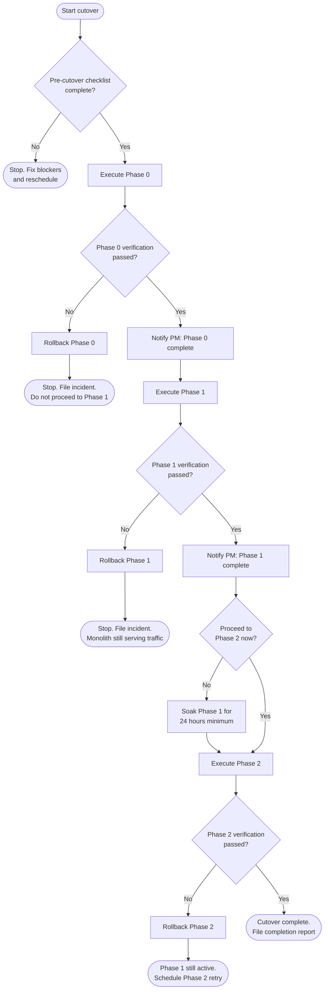

# Challenge 8 — The Weekend: Cutover Runbook

> **Context:** Northwind Logistics catalog service — Spring Music monolith.
> This is the operations runbook for migrating the monolith to extracted microservices
> using the Strangler Fig pattern defined in [ADR-001](../decisions/ADR-001-decomposition.md).
> It is written to be followed at 3am by someone who did not author the migration plan.

---

## Runbook Owner and Roles

| Role | Responsibility |
|------|---------------|
| Release engineer | Executes all steps, owns go/no-go calls |
| On-call developer | Available by phone; has merge rights |
| QA | Runs smoke tests after each phase |
| Stakeholder (PM) | Notified at phase start and phase complete |

**Minimum team to proceed:** Release engineer + one developer reachable within 10 minutes.

---

## Overview

This runbook covers three phases, executed in order. Each phase has a verification step and a rollback trigger. **Do not start Phase 1 if Phase 0 has not been verified. Do not start Phase 2 if Phase 1 has not been verified.**

| Phase | Name | Risk | Estimated duration |
|-------|------|------|--------------------|
| 0 | Operational Safety | None (deletion only) | 15 min |
| 1 | Extract Album Catalog Service | Low | 60 min |
| 2 | Refactor Platform Adapter | High | 90 min |

---

## Pre-Cutover Checklist

Complete all items before starting Phase 0. If any item cannot be checked off, **stop and reschedule**.

- [ ] Characterization test suite is green on the current monolith (`./gradlew test`)
- [ ] Database backup taken and restore tested within the last 24 hours
- [ ] Deployment pipeline is green on `master`
- [ ] On-call developer is reachable (confirmed via message, not assumed)
- [ ] Monitoring dashboard is open and baseline metrics noted:
  - p50 / p99 latency for `GET /albums`
  - Error rate (5xx) over the last 30 minutes
  - Current active Spring profile (from `/appinfo`)
- [ ] Rollback artefacts are staged (previous image tag / git SHA noted below)

**Previous stable SHA / image tag:** `___________________________`

---

## Go / No-Go Decision Tree



---

## Phase 0 — Operational Safety

**Risk:** None. This is a deletion, not an extraction. The monolith continues serving all business traffic.

**What changes:**
- `ErrorController.java` is deleted — removes `/errors/kill`, `/errors/fill-heap`, `/errors/throw`
- `application.yml` Actuator config is restricted — only `/actuator/health` and `/actuator/info` remain exposed

### Steps

1. **Delete ErrorController**

   ```bash
   git rm src/main/java/org/cloudfoundry/samples/music/web/ErrorController.java
   ```

2. **Restrict Actuator in `src/main/resources/application.yml`**

   Replace:
   ```yaml
   management:
     endpoints:
       web:
         exposure:
           include: "*"
     endpoint:
       health:
         show-details: always
   ```

   With:
   ```yaml
   management:
     endpoints:
       web:
         exposure:
           include: "health,info"
     endpoint:
       health:
         show-details: never
   ```

3. **Build and run tests**

   ```bash
   ./gradlew test
   ```

   Expected: all tests green. If any test references `ErrorController`, delete that test — it was testing a bug.

4. **Deploy to staging**

   ```bash
   cf push spring-music -f manifest.yml
   ```

5. **Verification** (see below)

6. **Deploy to production** if staging verification passed.

### Phase 0 Verification

Run all checks. Every item must pass before marking Phase 0 complete.

```bash
# Dangerous endpoints must be gone
curl -s -o /dev/null -w "%{http_code}" https://<host>/errors/kill
# Expected: 404

curl -s -o /dev/null -w "%{http_code}" https://<host>/errors/fill-heap
# Expected: 404

curl -s -o /dev/null -w "%{http_code}" https://<host>/errors/throw
# Expected: 404

# Business endpoint must still work
curl -s -o /dev/null -w "%{http_code}" https://<host>/albums
# Expected: 200

# Only health and info actuator endpoints should be reachable
curl -s -o /dev/null -w "%{http_code}" https://<host>/actuator/health
# Expected: 200

curl -s -o /dev/null -w "%{http_code}" https://<host>/actuator/env
# Expected: 404

curl -s -o /dev/null -w "%{http_code}" https://<host>/actuator/heapdump
# Expected: 404
```

### Phase 0 Rollback Trigger

Roll back Phase 0 if **any** of the following occur within 5 minutes of deployment:
- Any `5xx` response on `GET /albums`
- `GET /actuator/health` returns anything other than `200`
- Application fails to start (check `cf logs spring-music --recent`)

### Phase 0 Rollback Procedure

```bash
# Revert to previous git SHA
git revert HEAD --no-edit
git push origin master

# Redeploy previous version
cf push spring-music -f manifest.yml

# Confirm recovery
curl -s -o /dev/null -w "%{http_code}" https://<host>/albums
# Expected: 200
```

---

## Phase 1 — Extract Album Catalog Service

**Risk:** Low. The new service runs alongside the monolith. The API Façade routes `/albums/*` to the new service. The monolith remains deployed and can take back traffic instantly on rollback.

**What changes:**
- New `catalog-service` is deployed (Spring Boot 3.x, Java 17, PostgreSQL)
- `AlbumRepositoryPopulator` logic is moved to `catalog-service` as an explicit `DataInitializer`
- API Façade is configured to route `GET/PUT/POST/DELETE /albums` to `catalog-service`
- Monolith `/albums` endpoints remain live until contract tests pass

### Steps

1. **Confirm Phase 0 is verified and green.** Do not proceed otherwise.

2. **Build and deploy `catalog-service`**

   ```bash
   cd catalog-service
   ./gradlew build
   cf push catalog-service -f manifest.yml
   ```

3. **Verify new service is up and seeded**

   ```bash
   curl -s https://<catalog-service-host>/albums | jq 'length'
   # Expected: > 0  (seed data loaded from albums.json)
   ```

4. **Run contract tests** — new service must match monolith responses for all `GET /albums` calls

   ```bash
   ./gradlew contractTest
   # Expected: all green
   ```

5. **Configure API Façade** to route `/albums/*` to `catalog-service`

   Update the façade routing config:
   ```yaml
   routes:
     - path: /albums/**
       target: https://<catalog-service-host>
     - path: /**
       target: https://<monolith-host>
   ```

6. **Deploy API Façade**

   ```bash
   cf push api-facade -f facade/manifest.yml
   ```

7. **Verification** (see below)

### Phase 1 Verification

```bash
# All album endpoints work through the façade
curl -s -o /dev/null -w "%{http_code}" https://<facade-host>/albums
# Expected: 200

curl -s https://<facade-host>/albums | jq 'length'
# Expected: same count as before cutover

# Response shape matches monolith (spot check one album)
curl -s https://<facade-host>/albums/<known-id> | jq '{id, title, artist, albumId}'
# Expected: same field names and values as pre-cutover

# Non-album endpoints still routed to monolith
curl -s -o /dev/null -w "%{http_code}" https://<facade-host>/appinfo
# Expected: 200

# Characterization test suite must pass against the façade
./gradlew characterizationTest -Dbase.url=https://<facade-host>
# Expected: all green
```

### Phase 1 Rollback Trigger

Roll back Phase 1 if **any** of the following occur within the first 10 minutes after façade goes live:
- Error rate on `GET /albums` exceeds 1% (check monitoring dashboard)
- p99 latency exceeds 2× the pre-cutover baseline
- Any `5xx` from the façade on album endpoints
- Seed data missing (`GET /albums` returns empty array)

### Phase 1 Rollback Procedure

```bash
# Step 1: Reroute façade back to monolith for all traffic
# Update façade routing config:
#   routes:
#     - path: /**
#       target: https://<monolith-host>
cf push api-facade -f facade/manifest.yml

# Step 2: Confirm monolith is serving albums
curl -s -o /dev/null -w "%{http_code}" https://<facade-host>/albums
# Expected: 200

# Step 3: Stop catalog-service (do not delete — keep for investigation)
cf stop catalog-service

# Step 4: Notify on-call developer and PM
```

---

## Phase 2 — Refactor Platform Adapter

**Risk:** High. `SpringApplicationContextInitializer` runs before Spring context initialisation. Changes here affect all startup paths — all three database profiles (default/jpa, mongodb, redis).

**Prerequisite:** Phase 1 must be stable for at least 24 hours before starting Phase 2.

**What changes:**
- `InfoController` refactored to inject `CfEnv` rather than instantiating it directly
- `SpringApplicationContextInitializer` broken into focused components: profile validation, auto-config exclusion
- CF service-tag detection replaced with `SPRING_PROFILES_ACTIVE` environment variable
- When fully off CF: `SpringApplicationContextInitializer` is dissolved

### Steps

1. **Confirm Phase 1 has been stable for 24 hours.** Check monitoring dashboard — no elevated error rates overnight.

2. **Refactor `InfoController`** — replace `new CfEnv()` with constructor injection

   ```java
   // Before
   public InfoController(Environment spring) {
       this.cfEnv = new CfEnv();
   }

   // After
   public InfoController(Environment spring, CfEnv cfEnv) {
       this.cfEnv = cfEnv;
   }
   ```

3. **Declare `CfEnv` as a Spring Bean** in configuration so it can be injected

4. **Split `SpringApplicationContextInitializer`** into:
   - `ProfileValidator` — mutual exclusion check only
   - `AutoConfigExcluder` — exclusion list only
   - Remove CF detection if `SPRING_PROFILES_ACTIVE` is now set externally

5. **Run all tests across all profiles**

   ```bash
   ./gradlew test                              # default profile (H2)
   ./gradlew test -Dspring.profiles.active=mysql
   ./gradlew test -Dspring.profiles.active=mongodb
   ./gradlew test -Dspring.profiles.active=redis
   ```

6. **Deploy to staging and verify all profiles start correctly**

7. **Deploy to production**

### Phase 2 Verification

```bash
# Application starts — check active profile
curl -s https://<facade-host>/appinfo | jq '.profiles'
# Expected: matches SPRING_PROFILES_ACTIVE env var

# Catalog still works after platform refactor
curl -s -o /dev/null -w "%{http_code}" https://<facade-host>/albums
# Expected: 200

# Health check still green
curl -s https://<facade-host>/actuator/health | jq '.status'
# Expected: "UP"

# Characterization tests still pass
./gradlew characterizationTest -Dbase.url=https://<facade-host>
# Expected: all green
```

### Phase 2 Rollback Trigger

Roll back Phase 2 if **any** of the following occur within 10 minutes of deployment:
- Any Spring profile fails to start (check `cf logs --recent`)
- `GET /albums` returns `5xx` or empty array (seed data regression)
- `GET /appinfo` returns wrong profile or throws an error

### Phase 2 Rollback Procedure

```bash
# Revert to previous commit
git revert HEAD --no-edit
git push origin master

# Redeploy
cf push spring-music -f manifest.yml

# Verify monolith is back
curl -s -o /dev/null -w "%{http_code}" https://<facade-host>/albums
# Expected: 200

# Phase 1 (catalog-service + façade) is still active — no change needed there
```

---

## Dry-Run Log

Use this table to record each rehearsal before the real cutover. At least one dry-run is required before executing in production.

| Date | Performer | Environment | Phase | Outcome | Issues found | Notes |
|------|-----------|-------------|-------|---------|--------------|-------|
| | | staging | 0 | | | |
| | | staging | 1 | | | |
| | | staging | 2 | | | |

**Dry-run sign-off:** A dry-run is only complete when all three phases reach their verification step green in a non-production environment. Record the name of the person who signed off below.

**Signed off by:** `___________________________`  **Date:** `___________________________`

---

## Post-Cutover Tasks

After all phases are verified in production:

- [ ] Update `decisions/ADR-001-decomposition.md` status from `Proposed` to `Accepted`
- [ ] Archive monolith endpoints in API documentation (mark deprecated)
- [ ] Open ticket for frontend modernization (AngularJS → current framework)
- [ ] Schedule Phase 3: decommission monolith once catalog-service is stable for 30 days
- [ ] Add `catalog-service` to the CI/CD pipeline
- [ ] File completion report with PM and stakeholders

---

## Quick Reference: Rollback Decision Matrix

| Symptom | Phase to roll back | Time limit to decide |
|---------|-------------------|---------------------|
| `5xx` on `GET /albums` | Current phase | 5 minutes |
| Error rate > 1% | Current phase | 3 minutes |
| p99 latency > 2× baseline | Current phase | 3 minutes |
| App fails to start | Current phase | Immediately |
| Seed data missing | Current phase | 5 minutes |
| Profile wrong on `/appinfo` | Phase 2 | 10 minutes |

**When in doubt, roll back.** The monolith remains deployed throughout Phase 0 and Phase 1. Rolling back has no user impact — traffic returns to the monolith instantly.
